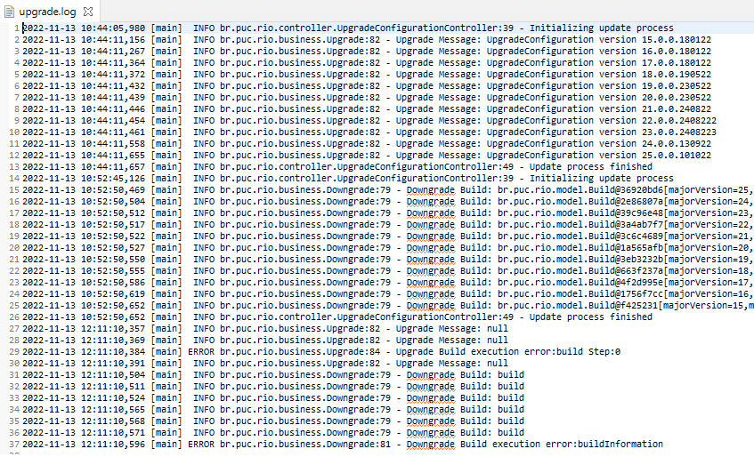

---
author:
- Raphael Cabral
bibliography:
- main.bib
dedication: |
  To my parents, for their support\
  and encouragement.
title: Upgrade Configuration
---

# Introduction

Normally Scripts executed in the database do not have the same level of
organization as versioned code bases. Even if the Script content is
versioned, there is no guarantee that its execution will be synchronized
with the evolution of the code base. This process is often done
manually, which can lead to a risk of human error, or automated by
resources external to the application, which can bring difficulties for
the developer.

In order to bring the same level of organization already observed in the
versioned code bases, Upgrade Configuration is a tool that aims to bring
order and organization to the Scripts that are executed in the database,
working as a version control of the same. A tool like this allows you
to:

-   Synchronize the database with the application version;

-   Know which Scripts were executed or not;

-   Automate the execution of scripts;

-   Create a database from scratch;

-   Allows to create a rollback of changes to the database.

The remainder of this document is organized as follows. In Section 2 we
provide the specification of Upgrade Configuration. In Section 3, we
describe the project, the architecture of application. Section 4 will
present the source code repository, the result of its static analysis,
Software Design Patterns and Good practices adopted. Next, Tests
composed of Unit Tests and Integration Tests, are introduced in Section
5. Lastly, an User Manual by Upgrade Configuration is presented on
Section 5.

# Specification {#cha:Specification}

This section presents the specification of the system developed in this
work. Thus, the goals, requirements and use cases are provided.

## Goal

The Goal of the application is to create a version control for the
database, so that the developer has the power to migrate it easily and
with security. Where database evolutions are shipped along with the
application and run automatically at startup.

The software facilitates continuous delivery process and favors the
expansion of the agile development culture and devops.

## Requirements

This subsection presents the functional and non-functional requirements
of the project.

### Functional Requirements

\[FR1\] The software must allow the developer to upgrade its base of
data, together with its codebase.

\[FR2\] The software must allow the developer to perform regression of
your database, together with your codebase.

\[FR3\] The software must allow the developer to create a database from
scratch;

\[FR4\] The software must allow the developer to Automate the execution
of scripts;

\[FR5\] The software must allow the developer to Synchronize the
database with the application version;

### Non Functional Requirements

\[NFR1\] The software must support its use in java applications that
make use of JPA.

\[NFR2\] The software must support its use as a Maven plugin for Java
applications.

\[NFR3\] The software must support Upgrade and Downgrade control through
the manipulation of an XML file by the user.

\[NFR4\] Users must be able to use the product after reading the user
manual.

## Use Cases

This section presents the use case diagram and describes each use case
in the program.

### Use Case Diagram

The use case diagram is shown in Figure
[2.1](#fig:use-case-diagram){reference-type="ref"
reference="fig:use-case-diagram"}.

{#fig:use-case-diagram
width="14cm"}

### Use Cases Description

This subsection further describes each use case found in Figure
[2.1](#fig:use-case-diagram){reference-type="ref"
reference="fig:use-case-diagram"}.

::: tabular
\|ll\|\
\
\
& System\
&\
:::

::: tabular
\|ll\|\
\
\
& System\
&\
:::

::: tabular
\|ll\|\
\
\
& System\
&

::: {#tab:use-case-3}
  ---------------------------------------------
  1 -- System loads list of Builds from
  the upgrade-configuration.xml file.
  2 -- System verifies that there is no Build
  marked for Downgrading.
  3 -- System \<\<extend\>\>"Upgrade Build".
  ---------------------------------------------

  : Use Case 3: Update Build.
:::

\
\
\
& System\
&

::: {#tab:use-case-3}
  -----------------------------------------------
  2.1 - System verifies that there is a Build
  marked for Downgrading.
  2.2 - System \<\<extend\>\>"Downgrade Build".
  -----------------------------------------------

  : Use Case 3: Update Build.
:::

\
:::

::: tabular
\|ll\|\
\
\
& System\
&

::: {#tab:use-case-4}
  -------------------------------------------
  1 -- System loads list of Builds from
  the upgrade-configuration.xml file.
  2-- System loads the latest build applied
  to the system.
  3 -- System creates list of builds that
  have not yet been applied.
  4 -- System verifies that the list of
  builds to apply is not empty.
  5 -- System performs the upgrade steps
  for each build retrieved in step 3.
  6 -- System does not find an error in the
  performed upgrade steps.
  7 - System persists information of Builds
  applied in the system.
  -------------------------------------------

  : Use Case 4: Upgrade Build.
:::

\
\
\
& System\
&

::: {#tab:use-case-4}
  -------------------------------------------------------------------
  4.1 -- System verifies that the list of builds to apply is empty.
  4.2 -- System interrupts the execution of the use case.
  -------------------------------------------------------------------

  : Use Case 4: Upgrade Build.
:::

\
\
& System\
&

::: {#tab:use-case-4}
  -------------------------------------------------------------
  6.1 -- System detects error in the performed upgrade steps.
  6.3- System persists information of Builds applied
  in the system in a partial way.
  -------------------------------------------------------------

  : Use Case 4: Upgrade Build.
:::

\
:::

::: tabular
\|ll\|\
\
\
& System\
&

::: {#tab:use-case-5}
  ----------------------------------------------------------
  1 -- System loads list of Builds from
  the upgrade-configuration.xml file.
  2-- System loads the latest build applied to the system.
  3 -- System creates list of builds for regression.
  4 -- System verifies that the list of builds for
  regression is not empty.
  5 -- System performs the downgrade steps
  of each build retrieved in step 3.
  6 -- System does not detect an error in the
  downgrade steps performed.
  7 - System removes persistence of regressed builds.
  ----------------------------------------------------------

  : Use Case 5: Downgrade Build.
:::

\
\
\
& System\
&

::: {#tab:use-case-5}
  ------------------------------------------------
  4.1 -- System verifies that the list of builds
  for regression is empty.
  4.2 -- System interrupts the execution
  of the use case.
  ------------------------------------------------

  : Use Case 5: Downgrade Build.
:::

\
\
& System\
&

::: {#tab:use-case-5}
  ------------------------------------
  6.1 -- System detects error in the
  downgrade steps performed.
  6.2- System partially removes
  persistence of regressed builds.
  ------------------------------------

  : Use Case 5: Downgrade Build.
:::

\
:::

# Project {#cha:Project}

This section presents the Project of the system developed in this work.
Thus, the Architecture and Diagrams are provided.

## Architecture

The upgrade configuration is a monolithic application that can be used
as a dependency of your application, which can be monitic or
distributed. All organization related to packages and relationship
between classes, is described through the Class Diagram, available in
subsection [3.2.2](#Class Diagram){reference-type="ref"
reference="Class Diagram"}.

The organization of the persistence layer, is described through the
Entity relationship Diagram, available in subsection
[3.2.1](#Entity relationship Diagram){reference-type="ref"
reference="Entity relationship Diagram"}.

Figure [3.1](#fig:architecture.monolithic){reference-type="ref"
reference="fig:architecture.monolithic"} presents the architecture of
the Upgrade Configuration when used in the initialization of a
monolithic application.

{#fig:architecture.monolithic
width="15cm"}

Figure [3.2](#fig:architecture){reference-type="ref"
reference="fig:architecture"} presents the architecture of the Upgrade
Configuration when used in the initialization of a distributed
application.

{#fig:architecture width="15cm"}

## Diagrams

This section presents the Entity relationship Diagram and the Class
Diagram.

### Data Modeling: Entity relationship {#Entity relationship Diagram}

The Entity relationship is shown in Figure
[3.3](#fig:entity–relationship){reference-type="ref"
reference="fig:entity–relationship"}.

{#fig:entity–relationship
width="4cm"}

### Class Diagram {#Class Diagram}

The Class Diagram is shown in Figure
[3.4](#fig:class-diagram){reference-type="ref"
reference="fig:class-diagram"} or available on GitHub at
[https://github.com/rcabral/upgrade-configuration/blob/main/source/upgrade-configuration/diagrams/class-diagram.svg](https://htmlpreview.github.io/?https://github.com/rcabral/upgrade-configuration/blob/main/source/upgrade-configuration/diagrams/class-diagram.svg)
for a better view.

{#fig:class-diagram
width="15cm"}

# Source Code {#cha:Source Code}

The source code repository, the static analysis execution report, design
patterns used and good development practices adopted will be presented
in this section.

## Repository

The source code, properly commented, is available on the GitHub
platform.

Repository URL: <https://github.com/rcabral/upgrade-configuration>.

## Static Analysis

To perform the static analysis of the source code, the PMD Maven Plugin
was used. PMD [@pmdwebsite] is a source code analyzer, it finds common
programming flaws like unused variables, empty catch blocks, unnecessary
object creation, and so forth.

The static analysis of the code performed by PMD found no problems in
the source code. The result can be seen through the report available in
Figure [4.1](#fig:static-analysis){reference-type="ref"
reference="fig:static-analysis"} or through the original report
available on GitHub at
[https://github.com/rcabral/upgrade-configuration/blob/main/source/upgrade-configuration/target/site/pmd.html](https://htmlpreview.github.io/?https://github.com/rcabral/upgrade-configuration/blob/main/source/upgrade-configuration/target/site/pmd.html).

{#fig:static-analysis width="14cm"}

## Software Design Patterns and Good practices adopted

The application was developed using the object-oriented programming
paradigm. And it took into account the following Design Patterns and
Good practices: SOLID object-oriented programming principles
[@martin1995principles], Design Patterns techniques [@gamma1995design],
and clean code practices [@martin2009clean].

# Test {#cha:Test}

This section presents the Project of the system developed in this work.
Thus, the details of Unit Tests and Integration Tests are provided.

## Unit Tests

To mitigate the threat related to the presence of bugs in the source
code, unit tests were developed.

The framework used to implement the unit tests, a execution report and
code coverage are presented in this section.

### Frameworks

The Frameworks adopted to develop the automatized Test Cases will be
presented in this section;

#### JUnit 4

In order to take advantage of Java platform, a test framework was
employed in this work. JUnit 4 [@junit4] is a test framework for Java
applications that support the development of test cases in a seamless
way, such as providing primitives for stating pre and post conditions on
each test case developed.

#### Mockito

Mockito [@mockito] is an open source testing framework for Java. The
framework allows the creation of test double objects (mock objects) in
automated unit tests.

It was the tool that made it possible to create mocks and stubs for
implementing unit tests.

### Execution Report

No human intervention was needed in order to test application logic. The
Surefire Plugin [@surefire] was used during the Test Phase of the build
lifecycle to execute the unit tests and generate the report.

The execution report is composed of Summary, Package List and Test
Cases. It´s presented through the Figures
[5.1](#fig:execution-report-part1){reference-type="ref"
reference="fig:execution-report-part1"},
[5.2](#fig:execution-report-part2){reference-type="ref"
reference="fig:execution-report-part2"},
[5.3](#fig:execution-report-part3){reference-type="ref"
reference="fig:execution-report-part3"},
[5.4](#fig:execution-report-part4){reference-type="ref"
reference="fig:execution-report-part4"},
[5.5](#fig:execution-report-part5){reference-type="ref"
reference="fig:execution-report-part5"},
[5.6](#fig:execution-report-part6){reference-type="ref"
reference="fig:execution-report-part6"},
[5.7](#fig:execution-report-part7){reference-type="ref"
reference="fig:execution-report-part7"} or through the original report
available on GitHub at
[https://github.com/rcabral/upgrade-configuration/blob/main/source/upgrade-configuration/target/site/surefire-report.html](https://htmlpreview.github.io/?https://github.com/rcabral/upgrade-configuration/blob/main/source/upgrade-configuration/target/site/surefire-report.html).

{#fig:execution-report-part1
width="14cm"}

{#fig:execution-report-part2
width="14cm"}

{#fig:execution-report-part3
width="14cm"}

{#fig:execution-report-part4
width="14cm"}

{#fig:execution-report-part5
width="14cm"}

{#fig:execution-report-part6
width="14cm"}

{#fig:execution-report-part7
width="14cm"}

### Code Coverage Report

No human intervention was needed to generate the code coverage report.
The Jacoco Maven Plugin [@jacoco] was used during the Test Phase of the
build lifecycle to generate the report.The Plugin provides the runtime
agent to the tests and allows the report creation during the build.

The Code Coverage carried out by Jacoco reached the result of 90%. The
result can be seen through the report available in Figure
[5.8](#fig:code-coverage-report){reference-type="ref"
reference="fig:code-coverage-report"} or through the original report
available on GitHub at
[https://github.com/rcabral/upgrade-configuration/blob/main/source/upgrade-configuration/target/site/jacoco/index.html](https://htmlpreview.github.io/?https://github.com/rcabral/upgrade-configuration/blob/main/source/upgrade-configuration/target/site/jacoco/index.html).

An observation is that we reached 90% code coverage with automated unit
tests, where we were able to exercise all the application's business
logic, without human intervention. Only two classes have not been tested
with automated unit tests, the UpgradeConfigurationControlle and JPAUtil
classes, they have static class calls that make it impossible to create
stunt objects (mock and stubs) for unit tests. However, these two
classes are tested in the integration test presented in section
[5.2](#cha:Integration Tests){reference-type="ref"
reference="cha:Integration Tests"}.

The Code Coverage Report report is presented through the Figure
[5.8](#fig:code-coverage-report){reference-type="ref"
reference="fig:code-coverage-report"}.

{#fig:code-coverage-report
width="14cm"}

## Integration Tests {#cha:Integration Tests}

To mitigate the threat related to the presence of bugs after the
integration of all parts of the system, upgrade and downgrade process
integration test were performed.

### Upgrade Build Process

This integration test exercises the Upgrade process, performing the
build upgrade from version 14.0.0.180122 to version 25.0.0.101022. The
video with the evidence of the entire execution process is available on
GitHub at
<https://github.com/rcabral/upgrade-configuration/raw/main/source/upgrade-configuration/src/test/resources/integration-tests-evidences/upgrade-integration-test.mp4>,
but can also be observed through Figure
[5.9](#fig:upgrade-integration-test){reference-type="ref"
reference="fig:upgrade-integration-test"}. And the Execution Log is
available in Figure [5.10](#fig:upgrade-log){reference-type="ref"
reference="fig:upgrade-log"}.

{#fig:upgrade-integration-test
width="14cm"}

{#fig:upgrade-log width="14cm"}

### Downgrade Build Process

This integration test exercises the Downgrade process, downgrading the
build from version 25.0.0.101022 to version 14.0.0.180122. The video
with the evidence of the entire execution process is available on GitHub
at
<https://github.com/rcabral/upgrade-configuration/raw/main/source/upgrade-configuration/src/test/resources/integration-tests-evidences/downgrade-integration-test.mp4>,
but can also be observed through Figure
[5.11](#fig:downgrade-integration-test){reference-type="ref"
reference="fig:downgrade-integration-test"}. And the Execution Log is
available in Figure [5.12](#fig:downgrade-log){reference-type="ref"
reference="fig:downgrade-log"}.

{#fig:downgrade-integration-test
width="14cm"}

{#fig:downgrade-log width="14cm"}

# User Manual {#cha:User Manual}

## Prerequisites

List:

-   JDK 8 or greater;

-   JPA 2 or greater;

-   Maven 3 or greater.

## How to Configure

Upgrade Configuration uses Maven to manage its dependencies. So, to add
Upgrade Configuration to your project, all you need to do is add the
following dependency:

    <dependency>
        <groupId>br.puc-rio</groupId>
        <artifactId>upgrade-configuration</artifactId>
        <version>1.0</version>
    </dependency>

Maven will take care of downloading all required dependencies.

## How to Use

### Creating your first Build

By convention, to manage your Builds, just create the file
upgrade-configuration.xml in the root of your project. The XML code
[\[first-build\]](#first-build){reference-type="ref"
reference="first-build"}, also present at
[https://github.com/rcabral/upgrade-configuration/raw/main/source/upgrade-configuration/demo/first-build/upgrade-configuration.xml](https://github.com/rcabral/upgrade-configuration/blob/main/source/upgrade-configuration/demo/first-build/upgrade-configuration.xml),
presents an example of creating your first Build. As can be seen, this
Build is composed of 2 steps, with an upgrade and a downgrade action.

``` {#first-build .xml language="XML" caption="First Build" label="first-build"}
<?xml version="1.0" encoding="UTF-8"?>
<UpgradeConfiguration xmlns:xsi="http://www.w3.org/2001/XMLSchema-instance" xsi:noNamespaceSchemaLocation="upgrade-configuration.xsd">
<!-- List of Builds -->
<build majorVersion="1" minorVersion="0" releaseVersion="0" buildNumber="151122" buildSequence="0">
	<!-- List of Steps -->
    <steps>
      <Step number="0">
        <!-- Upgrade Action -->
        <upgrade class="br.puc.rio.model.RunSQLAction">
          <sql>CREATE TABLE MY_FIRST_TABLE(id int(4) AUTO_INCREMENT,name varchar(30) NOT NULL,PRIMARY KEY (id));</sql>
        </upgrade>
         <!-- Downgrade Action -->
        <downgrade class="br.puc.rio.model.RunSQLAction">
          <sql>DROP TABLE MY_FIRST_TABLE;</sql>
        </downgrade>
      </Step>
      <Step number="1">
      	<!-- Upgrade Action -->
        <upgrade class="br.puc.rio.model.RunSQLAction">
          <sql>CREATE TABLE MY_SECOND_TABLE(id int(4) AUTO_INCREMENT,name varchar(30) NOT NULL,PRIMARY KEY (id));</sql>
        </upgrade>
      	<!-- Downgrade Action -->
        <downgrade class="br.puc.rio.model.RunSQLAction">
          <sql>DROP TABLE MY_SECOND_TABLE;</sql>
        </downgrade>
      </Step>
    </steps>
    <message>UpgradeConfiguration version 1.0.0.151122</message>
  </build>
</UpgradeConfiguration>
```

One note is that the downgrade action is not mandatory, only upgrade.

### Running The Upgrade Configuration {#Running The Upgrade Configuration}

To run the upgrade configuration and synchronize your builds declared in
the XML file with the database, just run the method named execute, from
the br.puc.rio.controller.UpgradeConfigurationController class.

It is recommended that this method be executed at server startup, so
that every build change is synchronized. The code
[\[startup-component\]](#startup-component){reference-type="ref"
reference="startup-component"} presents an example of creating a
component with Spring Boot, so that the method is executed at server
startup.

``` {#startup-component .java language="Java" caption="Running The Upgrade Configuration on Startup" label="startup-component"}
package br.puc.rio;

import br.puc.rio.controller.UpgradeConfigurationController;
import javax.annotation.PostConstruct;
import javax.annotation.PreDestroy;
import java.io.FileNotFoundException;
import org.springframework.stereotype.Component;

@Component
public class StartupComponent {

	@PostConstruct
	private void init() throws FileNotFoundException {
		UpgradeConfigurationController.execute();
	}

}
```

### Upgrade your Build

To create a new build and synchronize with your database. Add a new
build to the upgrade-configuration.xml file and run the upgrade
configuration as described in subsection
[6.3.2](#Running The Upgrade Configuration){reference-type="ref"
reference="Running The Upgrade Configuration"}.

An example of creating a new build in the upgrade-configuration.xml file
can be seen in XML code
[\[upgrade-build\]](#upgrade-build){reference-type="ref"
reference="upgrade-build"}. And it is also available on GitHub at
[https://github.com/rcabral/upgrade-configuration/raw/main/source/upgrade-configuration/demo/upgrade-build/upgrade-configuration.xml](https://github.com/rcabral/upgrade-configuration/blob/main/source/upgrade-configuration/demo/upgrade-build/upgrade-configuration.xml).
Note that the creation of the new build starts from line 35.

``` {#upgrade-build .xml language="XML" caption="Upgrade Build" label="upgrade-build"}
<?xml version="1.0" encoding="UTF-8"?>
<UpgradeConfiguration
	xmlns:xsi="http://www.w3.org/2001/XMLSchema-instance"
	xsi:noNamespaceSchemaLocation="upgrade-configuration.xsd">
	<!-- List of Builds -->
	<build majorVersion="1" minorVersion="0" releaseVersion="0"
		buildNumber="151122" buildSequence="0">
		<!-- List of Steps -->
		<steps>
			<Step number="0">
				<!-- Upgrade Action -->
				<upgrade class="br.puc.rio.model.RunSQLAction">
					<sql>CREATE TABLE MY_FIRST_TABLE(id int(4) AUTO_INCREMENT,name
						varchar(30) NOT NULL,PRIMARY KEY (id));</sql>
				</upgrade>
				<!-- Downgrade Action -->
				<downgrade class="br.puc.rio.model.RunSQLAction">
					<sql>DROP TABLE MY_FIRST_TABLE;</sql>
				</downgrade>
			</Step>
			<Step number="1">
				<!-- Upgrade Action -->
				<upgrade class="br.puc.rio.model.RunSQLAction">
					<sql>CREATE TABLE MY_SECOND_TABLE(id int(4) AUTO_INCREMENT,name
						varchar(30) NOT NULL,PRIMARY KEY (id));</sql>
				</upgrade>
				<!-- Downgrade Action -->
				<downgrade class="br.puc.rio.model.RunSQLAction">
					<sql>DROP TABLE MY_SECOND_TABLE;</sql>
				</downgrade>
			</Step>
		</steps>
		<message>UpgradeConfiguration version 1.0.0.151122</message>
	</build>
	<!-- New Build declaration -->
	<build majorVersion="2" minorVersion="0" releaseVersion="0"
		buildNumber="161122" buildSequence="0">
		<!-- List of Steps -->
		<steps>
			<Step number="0">
				<!-- Upgrade Action -->
				<upgrade class="br.puc.rio.model.RunSQLAction">
					<sql>CREATE TABLE MY_THIRD_TABLE(id int(4) AUTO_INCREMENT,name
						varchar(30) NOT NULL,PRIMARY KEY (id));</sql>
				</upgrade>
				<!-- Downgrade Action -->
				<downgrade class="br.puc.rio.model.RunSQLAction">
					<sql>DROP TABLE MY_THIRD_TABLE;</sql>
				</downgrade>
			</Step>
			<Step number="1">
				<!-- Upgrade Action -->
				<upgrade class="br.puc.rio.model.RunSQLAction">
					<sql>CREATE TABLE FOURTH (id int(4) AUTO_INCREMENT,name
						varchar(30) NOT NULL,PRIMARY KEY (id));</sql>
				</upgrade>
				<!-- Downgrade Action -->
				<downgrade class="br.puc.rio.model.RunSQLAction">
					<sql>DROP TABLE FOURTH ;</sql>
				</downgrade>
			</Step>
		</steps>
		<message>UpgradeConfiguration version 2.0.0.161122</message>
	</build>
</UpgradeConfiguration>
```

### Downgrade your Build

In some cases it may be valuable to downgrade your database to a point
earlier than the current one. In these cases, choose a previous build
and set the downgrade attribute to true. All later builds will be
regressed.

The XML code
[\[downgrade-build\]](#downgrade-build){reference-type="ref"
reference="downgrade-build"} shows an example where the Build
2.0.0.161122 is being downgraded to Build version 1.0.0.151122. It´s
also available on GitHub at
[https://github.com/rcabral/upgrade-configuration/raw/main/source/upgrade-configuration/demo/downgrade-build/upgrade-configuration.xml](https://github.com/rcabral/upgrade-configuration/blob/main/source/upgrade-configuration/demo/downgrade-build/upgrade-configuration.xml).
Note that in line 7 the downgrade attribute is set to true.

``` {#downgrade-build .xml language="XML" caption="Downgrade Build" label="downgrade-build"}
<?xml version="1.0" encoding="UTF-8"?>
<UpgradeConfiguration
	xmlns:xsi="http://www.w3.org/2001/XMLSchema-instance"
	xsi:noNamespaceSchemaLocation="upgrade-configuration.xsd">
	<!-- List of Builds -->
	<build majorVersion="1" minorVersion="0" releaseVersion="0"
		buildNumber="151122" buildSequence="0" downgrade="true">
		<!-- List of Steps -->
		<steps>
			<Step number="0">
				<!-- Upgrade Action -->
				<upgrade class="br.puc.rio.model.RunSQLAction">
					<sql>CREATE TABLE MY_FIRST_TABLE(id int(4) AUTO_INCREMENT,name
						varchar(30) NOT NULL,PRIMARY KEY (id));</sql>
				</upgrade>
				<!-- Downgrade Action -->
				<downgrade class="br.puc.rio.model.RunSQLAction">
					<sql>DROP TABLE MY_FIRST_TABLE;</sql>
				</downgrade>
			</Step>
			<Step number="1">
				<!-- Upgrade Action -->
				<upgrade class="br.puc.rio.model.RunSQLAction">
					<sql>CREATE TABLE MY_SECOND_TABLE(id int(4) AUTO_INCREMENT,name
						varchar(30) NOT NULL,PRIMARY KEY (id));</sql>
				</upgrade>
				<!-- Downgrade Action -->
				<downgrade class="br.puc.rio.model.RunSQLAction">
					<sql>DROP TABLE MY_SECOND_TABLE;</sql>
				</downgrade>
			</Step>
		</steps>
		<message>UpgradeConfiguration version 1.0.0.151122</message>
	</build>
	<!-- New Build declaration -->
	<build majorVersion="2" minorVersion="0" releaseVersion="0"
		buildNumber="161122" buildSequence="0">
		<!-- List of Steps -->
		<steps>
			<Step number="0">
				<!-- Upgrade Action -->
				<upgrade class="br.puc.rio.model.RunSQLAction">
					<sql>CREATE TABLE MY_THIRD_TABLE(id int(4) AUTO_INCREMENT,name
						varchar(30) NOT NULL,PRIMARY KEY (id));</sql>
				</upgrade>
				<!-- Downgrade Action -->
				<downgrade class="br.puc.rio.model.RunSQLAction">
					<sql>DROP TABLE MY_THIRD_TABLE;</sql>
				</downgrade>
			</Step>
			<Step number="1">
				<!-- Upgrade Action -->
				<upgrade class="br.puc.rio.model.RunSQLAction">
					<sql>CREATE TABLE FOURTH (id int(4) AUTO_INCREMENT,name
						varchar(30) NOT NULL,PRIMARY KEY (id));</sql>
				</upgrade>
				<!-- Downgrade Action -->
				<downgrade class="br.puc.rio.model.RunSQLAction">
					<sql>DROP TABLE FOURTH ;</sql>
				</downgrade>
			</Step>
		</steps>
		<message>UpgradeConfiguration version 2.0.0.161122</message>
	</build>
</UpgradeConfiguration>
```

### Execution Log

The execution log is available through the upgrade.log file at the root
of your project. An example of the Log can be seen in Figure
[6.2](#fig:execution-log){reference-type="ref"
reference="fig:execution-log"}.

{#fig:execution-log
width="14cm"}

### Checking synchronized Builds in the Database

To check the Builds applied to your Database, just check the contents of
the BuildInformation table in your database. This table is created
automatically on the first run of Upgrade Configuration.

An example can be seen in Figure
[6.2](#fig:execution-log){reference-type="ref"
reference="fig:execution-log"}

{#fig:execution-log width="14cm"}

## Detailing the structure of a Build

A build is composed of a list of Steps. As can be seen in the XML code
[\[first-build\]](#first-build){reference-type="ref"
reference="first-build"}.

### Detailing the structure of a Step

A step is composed of the number attribute and an upgrade action and
downgrade action. The number attribute informs the step sequence. The
upgrade action executes scripts in order to regress the database. The
downgrade action executes scripts in order to regress the database. As
can be seen in the XML code
[\[first-build\]](#first-build){reference-type="ref"
reference="first-build"}.

Note that the upgrade action is mandatory for every step, but the
downgrade action is optional.

### Types of Action

The types of actions available for Upgrade or Downgrade are just
implementations of the Action interface.

This subsection presents the RunSQLAction, RunSQLFileAction
implementations available for use. And an example of creating a custom
action.

#### RunSQLAction action type

To use the RunSQLAction action type, set the class attribute of the
upgrade, or downgrade tags with the value
\"br.puc.rio.model.RunSQLAction\". And fill the sql tag, with the sql
script to be executed. As can be seen in the XML code
[\[RunSQLAction\]](#RunSQLAction){reference-type="ref"
reference="RunSQLAction"}.

``` {#RunSQLAction .xml language="XML" caption="RunSQLAction sample" label="RunSQLAction"}
<!-- Upgrade Action -->
<upgrade class="br.puc.rio.model.RunSQLAction">
    <sql>CREATE TABLE MY_FIRST_TABLE(id int(4) AUTO_INCREMENT,name
						varchar(30) NOT NULL,PRIMARY KEY (id));</sql>
</upgrade>
```

#### RunSQLFileAction action type

To use the RunSQLFileAction action type, set the class attribute of the
upgrade, or downgrade tags with the value
\"br.puc.rio.model.RunSQLFileAction\". And fill the path tag, with the
path to the sql file that has the content to be executed. As can be seen
in the XML code
[\[RunSQLFileAction\]](#RunSQLFileAction){reference-type="ref"
reference="RunSQLFileAction"}.

``` {#RunSQLFileAction .xml language="XML" caption="RunSQLFileAction sample" label="RunSQLFileAction"}
<!-- Upgrade Action -->
<<upgrade class="br.puc.rio.model.RunSQLFileAction">
    <path>demo/upgrade-script.sql</path>
</upgrade>
```

#### Build example with custom action

To use a Custon action type, set the class attribute of the upgrade, or
downgrade tags with complete name of your custom class. As can be seen
in the XML code
[\[RunSQLFileAction\]](#RunSQLFileAction){reference-type="ref"
reference="RunSQLFileAction"}.

Your Custom Class just need to implements the interface Action, how the
sample code
[\[HelloCustomAction\]](#HelloCustomAction){reference-type="ref"
reference="HelloCustomAction"}. Also available on GitHub at
<https://github.com/rcabral/upgrade-configuration/blob/main/source/upgrade-configuration/src/main/java/br/puc/rio/sample/HelloCustomAction.java>.

``` {#CustomAction .xml language="XML" caption="CustomAction sample" label="CustomAction"}
<!-- Upgrade Action -->
<upgrade class="br.puc.rio.sample.HelloCustomAction"/>
```

``` {#HelloCustomAction .java language="Java" caption="HelloCustomAction sample" label="HelloCustomAction"}
package br.puc.rio.sample;

import javax.persistence.EntityManager;

import br.puc.rio.model.Action;

/**
 * A sample Class of a CustomAction implementation.
 */
public class HelloCustomAction implements Action {
	
	@Override
	public void execute(EntityManager entityManager) throws Exception {
		System.out.println("Hello Custom Action! Here you can put your arbitrary code.");
	}

}
```

## XSD with upgrade-configuration.xml structure details

The XSD file with details of the upgrade-configuration.xml structure is
available on GitHub at
<https://github.com/rcabral/upgrade-configuration/blob/main/source/upgrade-configuration/upgrade-configuration.xsd>.

## Sample Web Project

A Sample Web Project is available on GitHub at
<https://github.com/rcabral/upgrade-configuration/tree/main/source/sample-web-project>,
for free use and modification.
